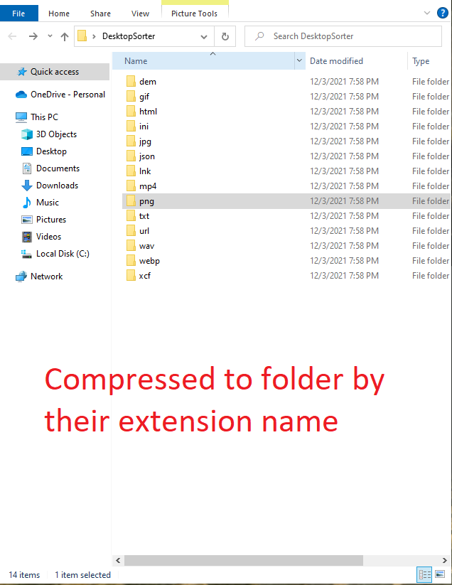

# DesktopSorter
C# Application, when ran, sorts your Desktop files by their extension name, into their own folders, in a folder named DesktopSorter  

## Compile yourself, or Download from Releases & Run from CMD Line:  
  
#### (this sorts all of your desktop items)
```
DesktopSorter.exe "compress"
```  
#### (this extracts all of your compressed items back to the desktop)  
```
DesktopSorter.exe "decompress"
```  


# Known Issues:  
```
1. Shortcuts aren't being moved to the compression path, needs further looking into.
```

# Image Example:
### (After running "compression")  
 
