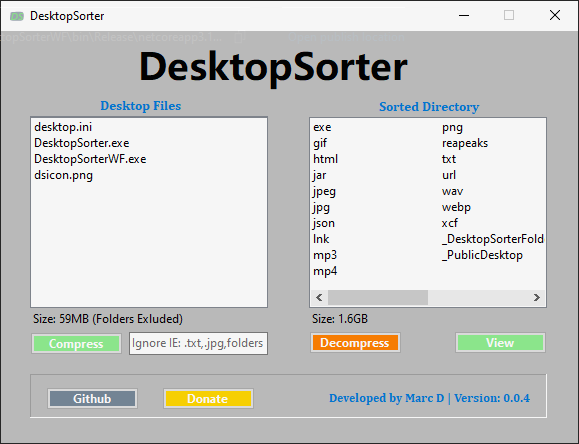
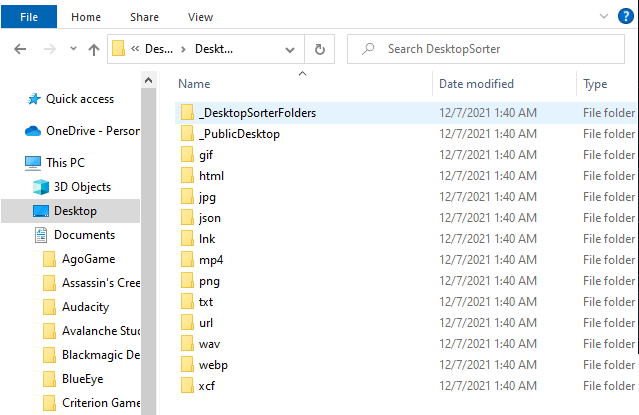

# DesktopSorter
Desktop Application written in C# that sorts and cleans your Desktop by doing the following:  

1. Groups all files, by extension-type, then moves the files to a folder named by said type (jpg, mp3, exe, etc).
2. Then, moves any folders less than 1 Gig in size, to a main folder named, "\_DesktopSorterFolders".  
3. Lastly, it stores all of these new folders and files, into a Main folder on your desktop named, "DesktopSorter".  
4. You can then run this program 'backwards' which places everything back onto the Desktop.    
##### ** USE AT YOUR OWN RISK **
##### Compile yourself, or Download from [Releases](https://github.com/mwd1993/DesktopSorter/releases) 

# Version 0.0.4 and higher provides an Interface



# Usage (0.0.3 and below) uses CMD line  
##### ** Recommended to run CMD as Administrator, not required though **
  
#### (this sorts all of your desktop items)
```
DesktopSorter.exe compress
```  
#### (this sorts all of your desktop items, ignoring extensions (or folders) seperated by ",")
```
DesktopSorter.exe compress .exe,.ini,folders,.mp3,.wav,.mp4
```  
#### (this extracts all of your compressed items back to the desktop)  
```
DesktopSorter.exe decompress
```  

# Image Example:
### (After running "compression")  
 
